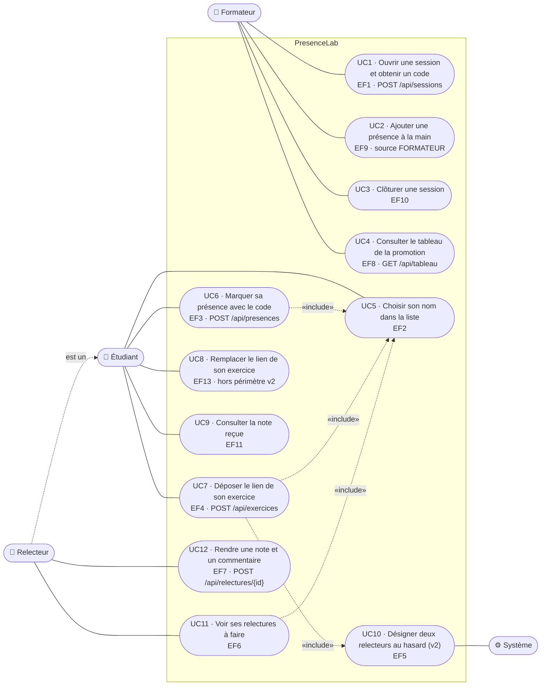

# D1 — Cas d'utilisation

Le relecteur n'est pas un acteur distinct : c'est un **étudiant** à qui une relecture a été assignée (voir la section 2 du cahier des charges). Il est représenté à part pour la lisibilité, relié à l'étudiant par une généralisation. Le **Système** est un acteur secondaire : il tire les relecteurs au sort.

| Cas | Priorité | Règles de gestion |
|---|---|---|
| UC1 | Must | RG1, RG18 |
| UC2 | Should | RG3, RG4 |
| UC3 | Should | RG2, RG8 |
| UC4 | Must | RG16, RG17 |
| UC5 | Must | — (Q1) |
| UC6 | Must | RG1, RG2, RG3, RG5 |
| UC7 | Must | RG6, RG7, RG8 |
| UC8 | Could → **sacrifié en v2** | RG9 |
| UC9 | Should | RG15 |
| UC10 | Must | RG10 (v2 : deux relecteurs), RG11, RG12 |
| UC11 | Must | RG15 |
| UC12 | Must | RG12, RG13, RG14 |
