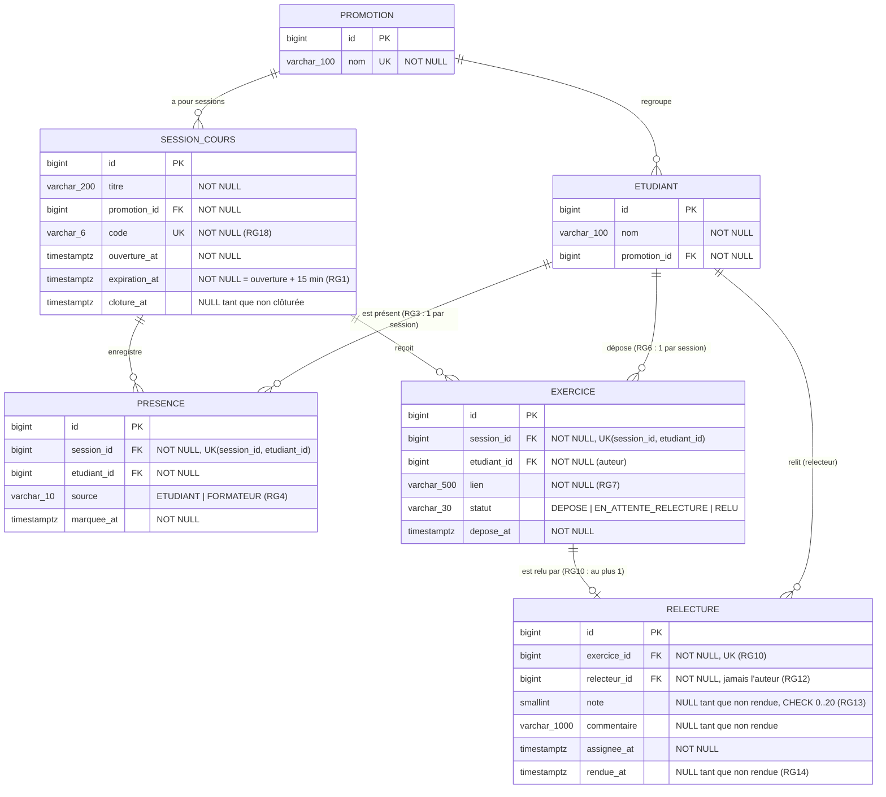

# D2 — Modèle de données

Ce diagramme correspond **exactement** aux migrations Flyway de `backend/src/main/resources/db/migration/` : mêmes tables, colonnes, types, contraintes. Toute évolution du schéma passe par une nouvelle migration **et** par une mise à jour de ce fichier dans le même commit.

Migrations décrites : `V1__schema_initial.sql`

## Contraintes portées par la base

| Contrainte | Table | Règle |
|---|---|---|
| `uk_promotion_nom` UNIQUE (nom) | promotion | — |
| `uk_session_code` UNIQUE (code) | session_cours | RG18 |
| `uk_presence_session_etudiant` UNIQUE (session_id, etudiant_id) | presence | RG3 |
| `ck_presence_source` CHECK source IN ('ETUDIANT','FORMATEUR') | presence | RG4 |
| `uk_exercice_session_etudiant` UNIQUE (session_id, etudiant_id) | exercice | RG6 |
| `ck_exercice_statut` CHECK statut IN ('DEPOSE','EN_ATTENTE_RELECTURE','RELU') | exercice | D4 |
| `uk_relecture_exercice` UNIQUE (exercice_id) | relecture | RG10 |
| `ck_relecture_note` CHECK note BETWEEN 0 AND 20 | relecture | RG13 |

Le **relecteur** n'a pas de table propre : c'est un `ETUDIANT` référencé par `relecture.relecteur_id` (cahier des charges, section 2). Le **formateur** n'est pas stocké, puisqu'il n'y a pas d'authentification (Q1, section 3).
