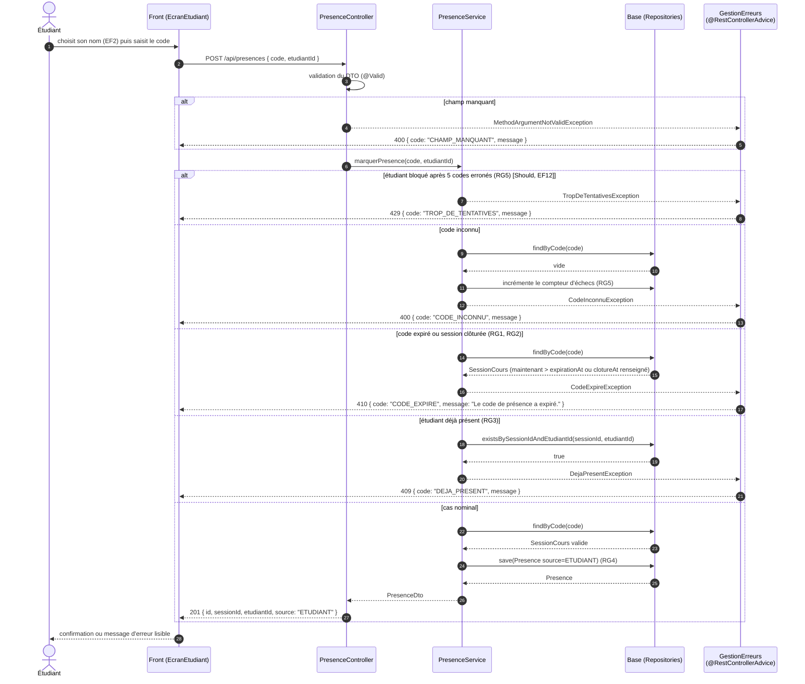

# D3 — Séquence : marquer sa présence

Opération imposée : `POST /api/presences` (contrat). L'ordre des vérifications suit l'hypothèse H6 du cahier des charges : **blocage → code inconnu → code expiré ou session clôturée → déjà présent → succès**. Chaque erreur renvoie le format imposé `{ code, message }`, produit par le `@RestControllerAdvice` unique (`GestionErreurs`).

| Cas | Code HTTP | `code` d'erreur | Règle | Dans le contrat |
|---|---|---|---|---|
| Présence enregistrée | 201 | — | RG4 | oui |
| Champ manquant | 400 | `CHAMP_MANQUANT` | — | oui (400) |
| Code inconnu | 400 | `CODE_INCONNU` | RG5 | oui |
| Étudiant inconnu | 400 | `ETUDIANT_INCONNU` | — | ajouté (400) |
| Étudiant d'une autre promotion | 400 | `ETUDIANT_HORS_PROMOTION` | H7 | ajouté (400) |
| Déjà présent | 409 | `DEJA_PRESENT` | RG3 | oui |
| Code expiré / session clôturée | 410 | `CODE_EXPIRE` | RG1, RG2 | oui |
| Trop de tentatives | 429 | `TROP_DE_TENTATIVES` | RG5 | ajouté (Should) |
