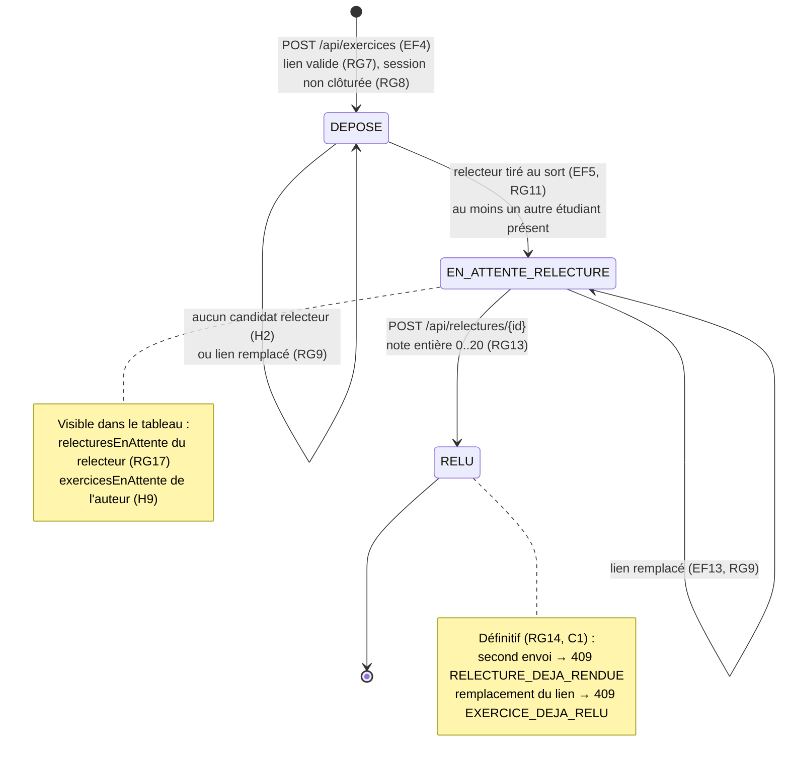

# D4 — États-transitions : cycle de vie d'un exercice

Valeurs de la colonne `exercice.statut` (migration V1, contrainte `ck_exercice_statut`).

| Transition | Déclencheur | Règle | Erreur si interdite |
|---|---|---|---|
| ∅ → DEPOSE | dépôt du lien | RG6, RG7, RG8 | 400 `LIEN_INVALIDE` · 409 `EXERCICE_DEJA_DEPOSE` · 409 `SESSION_CLOTUREE` |
| DEPOSE → EN_ATTENTE_RELECTURE | tirage du relecteur, dans la même transaction que le dépôt | RG10, RG11, RG12 | — (reste DEPOSE s'il n'y a aucun candidat) |
| EN_ATTENTE_RELECTURE → RELU | relecture rendue | RG13, RG14 | 400 `NOTE_INVALIDE` · 403 `AUTO_RELECTURE` · 409 `RELECTURE_DEJA_RENDUE` |
| RELU → (remplacement du lien) | interdit | RG9 | 409 `EXERCICE_DEJA_RELU` |
