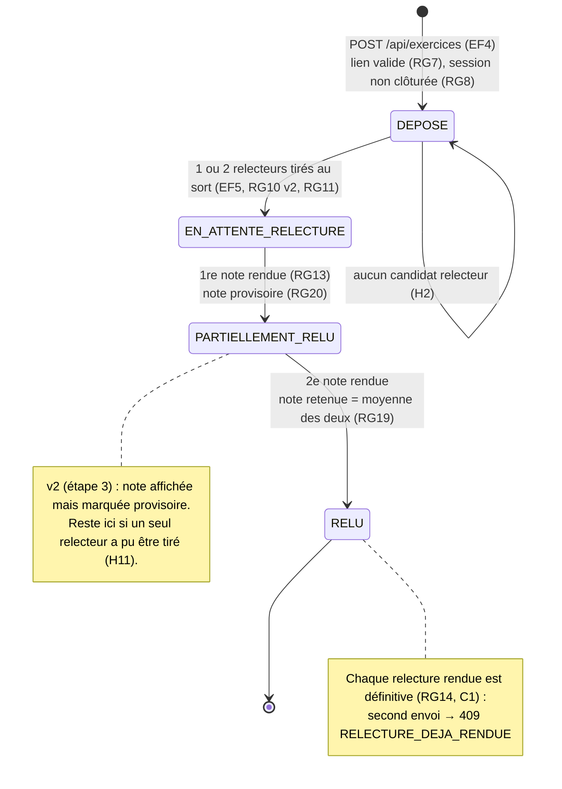

# D4 — États-transitions : cycle de vie d'un exercice

Valeurs de la colonne `exercice.statut` (migrations V1 puis V2, contrainte `ck_exercice_statut`). **v2 — conséquence du changement de l'étape 3** : ajout de l'état `PARTIELLEMENT_RELU`.

| Transition | Déclencheur | Règle | Erreur si interdite |
|---|---|---|---|
| ∅ → DEPOSE | dépôt du lien | RG6, RG7, RG8 | 400 `LIEN_INVALIDE` · 409 `EXERCICE_DEJA_DEPOSE` · 409 `SESSION_CLOTUREE` |
| DEPOSE → EN_ATTENTE_RELECTURE | tirage de deux relecteurs (un seul si un seul candidat), dans la même transaction que le dépôt | RG10, RG11, RG12 | — (reste DEPOSE s'il n'y a aucun candidat) |
| EN_ATTENTE_RELECTURE → PARTIELLEMENT_RELU | 1re relecture rendue | RG13, RG14, RG20 | 400 `NOTE_INVALIDE` · 403 `AUTO_RELECTURE` · 409 `RELECTURE_DEJA_RENDUE` |
| PARTIELLEMENT_RELU → RELU | 2e relecture rendue | RG19 | 400 `NOTE_INVALIDE` · 403 `AUTO_RELECTURE` · 409 `RELECTURE_DEJA_RENDUE` |
| RELU → (remplacement du lien) | interdit | RG9 | 409 `EXERCICE_DEJA_RELU` |
